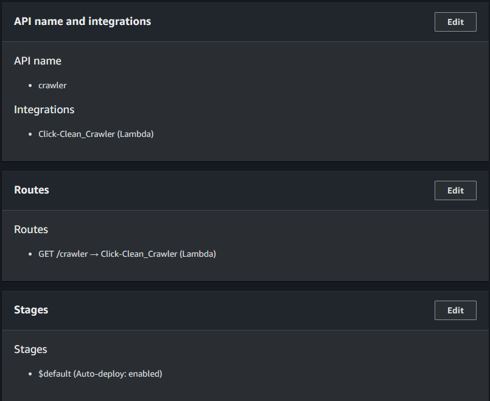

## AWS lambda

**Create function**  
Function Name : Click-Clean_Crawler  
Runtime : Python 3.12  
Architecture : x86_64  
Role : Use an existing role - LabRole  

## API Gateway
  
**API type : HTTP API**

#### Step 1. Create an API
Integrations : Lambda  
AWS Region : us-east-1  
Lambda function : Click-Clean_Crawler
Version 2.0
API name : crawler

Q. HTTP API vs REST API  

#### Step 2. Configure routes
Method : GET   
Resource path : /crawler   
Integration target : Click-Clean_Crawler  

#### Step 3. Define stages
Stage name : $default  
Auto-deploy : on

#### Step 4. Review and Create

